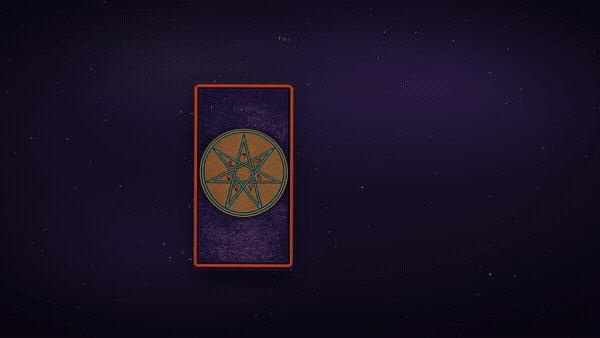
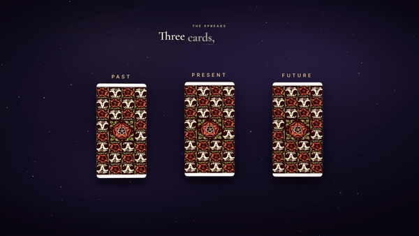
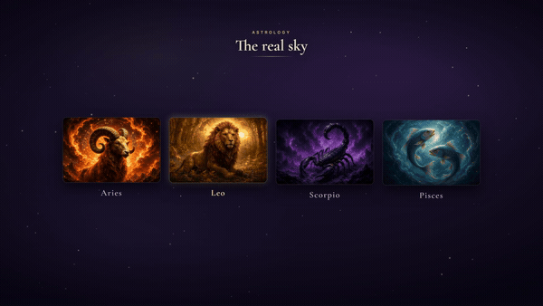

# Remotion Promo Engine

**Cinematic product promos, written in code — designed for AI coding agents.**

Point Claude Code / Codex / Cursor at this repo and ask for a promo video for
*your* app: your art, your brand, your features. The agent reads
[`AGENTS.md`](AGENTS.md) (the workflow) and [`METHOD.md`](METHOD.md) (the
craft rules distilled from a full production promo), harvests your app's real
colors/fonts/assets, writes the scenes, and renders a real MP4 — with
optional synthesized sound & music, and an optional ElevenLabs voiceover.

Born from building the launch video for a real product ([Umbral](https://umbralcosmos.com)):
a ~95-second, bilingual, fully voiced product tour — then extracted so any
project can reuse the engine and the method.

## See it in action

The engine's first production output: the launch promo for
**[Umbral](https://umbralcosmos.com)**, a tarot app. Fully code-authored — real
card art, a deep ElevenLabs voiceover, synthesized music & SFX, 14 scenes.

<p align="center"></p>

<table>
<tr>
<td width="50%"></td>
<td width="50%"></td>
</tr>
<tr>
<td width="50%"></td>
<td width="50%"></td>
</tr>
</table>

▶ **[Watch the full 95s video (with sound)](examples/umbral-tarot-promo-en.mp4)** — click to open the player on GitHub. Full-quality MP4 lives in [`examples/`](examples/).

## What's inside

| Layer | What | Needs |
|---|---|---|
| 🎬 **Video** | Motion primitives: `Camera` (promo punch-ins), `KineticText`, `TitleCard`, `FlipCard` (3D flips with material gloss), `Cursor` (click/drag demos), `LightSweep`, `Particles`, `Spark`, ambient `Starfield`+`Vignette` — all pure functions of the frame, themed by `src/theme.ts` | nothing — works out of the box |
| 🔊 **SFX + music** | `scripts/gen-sfx.mjs` synthesizes original audio from pure math (chime, whoosh, pops, ticks, card flicks, an ambient chord pad) — deterministic, zero third-party copyright | nothing |
| 🎙 **Voice** | `scripts/gen-voice.mjs` — ElevenLabs pipeline with per-line **caching** (unchanged lines are never re-billed), voice preferences, accent-steering-via-text | your ElevenLabs API key in `.env` |
| 🌍 **Locales** | `scripts/clone-locale.mjs` — master locale untouched, clones generated from fail-loud replacement maps | nothing |
| 🎚 **Mastering** | `scripts/master.mjs` — measures LUFS, normalizes to −15.5 LUFS / −1.5 dBTP | nothing |

## Quickstart (human)

```bash
git clone https://github.com/ivorojas/remotion-promo-engine
cd remotion-promo-engine
npm install
npm run sfx        # synthesize the demo's audio
npm run render     # → out/demo.mp4  (the engine demoing itself)
npm run studio     # live editor with a timeline scrubber
```

## Quickstart (with your AI agent)

1. Copy this repo into your app as `video/` (or keep it standalone).
   **If it lives inside another project, add `"video"` to the host's
   `tsconfig.json` `exclude`** — or the host build will try to compile it.
2. Tell your agent:
   > Read `video/AGENTS.md` and `video/METHOD.md`. Then make a ~60s promo
   > for my app using my real brand and screenshots. Start with a shot list.
3. Iterate with plain language ("the whoosh masks the voice", "show the
   pricing screen next") — the agent changes numbers and re-renders.

## Philosophy

- **The video is code.** Deterministic, reviewable, versionable. Tweak one
  number → re-render. No timelines to re-edit from scratch.
- **Reuse the product's real identity.** Real colors, real fonts, real
  screenshots — that's what makes it look premium, not effects.
- **One motif, everywhere.** One transition, one easing family, one accent
  color doing the lighting. Consistency reads as money.
- **Everything optional.** Video-only, +sound, +voice — each layer stands
  alone.

## License

MIT (this engine). Remotion itself is free for individuals and small teams —
larger companies need a [Remotion company license](https://remotion.dev/license).
ElevenLabs voice requires your own account/key; free tier for testing,
paid tier for commercial use.
